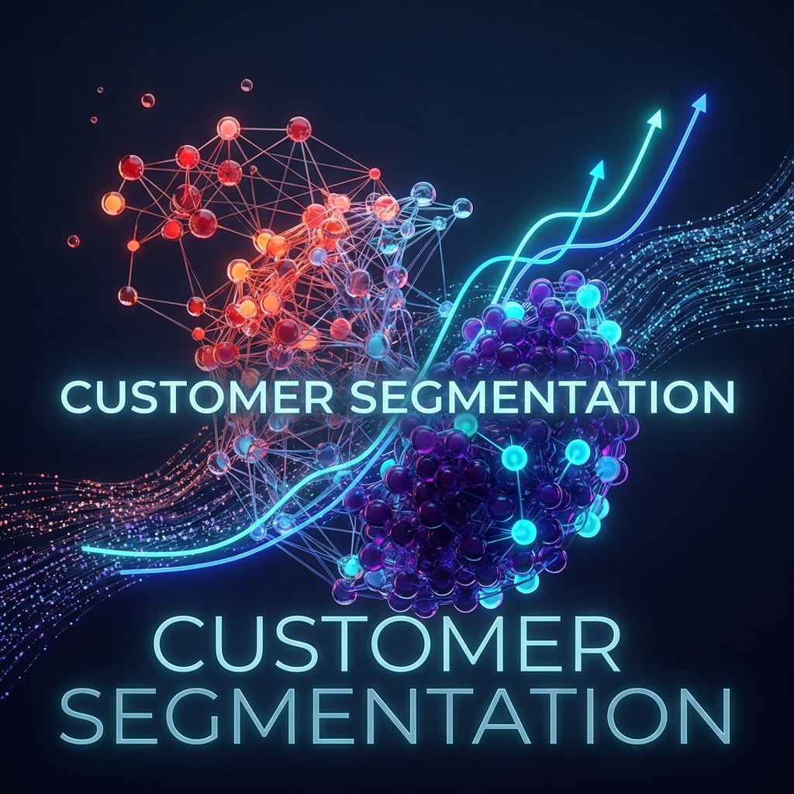

# 📊 Customer Segmentation & Churn Prediction  
**End-to-End Data Analytics & Machine Learning Project**

  
*Description: A high-level visual representing customer analytics, segmentation, and churn prediction in an online retail business.*

---

## 🧠 Business Problem

Online retail businesses lose significant revenue due to **customer churn**.  
This project answers two critical business questions:

1. Who are our most valuable and at-risk customers?
2. Can we predict churn early enough to take action?

---

## 🎯 Project Objectives

- Segment customers using **RFM Analysis** and **K-Means Clustering**
- Identify **loyal**, **high-value**, and **churn-risk** customers
- Build **machine learning models** to predict churn
- Deliver **actionable insights** through an interactive Power BI dashboard

---

## 🏗️ End-to-End Architecture

  
*Description: End-to-end data pipeline showing the flow from raw data ingestion to machine learning models and business dashboards.*

---

## 🔎 Key Analytical Components

### 1️⃣ Data Cleaning & Feature Engineering  
**Tools:** SQL, Python

- Removed cancelled and invalid transactions  
- Handled missing values and inconsistent timestamps  
- Engineered key business metrics:
  - Gross Merchandise Value (GMV)
  - Average Order Value (AOV)
  - Customer lifetime spend  

---

### 2️⃣ Customer Segmentation (RFM + K-Means)

  
*Description: Visualization of customer clusters formed using RFM metrics and K-Means clustering.*

**RFM Metrics**
- **Recency:** Days since last purchase  
- **Frequency:** Number of transactions  
- **Monetary:** Total spend  

---

### 3️⃣ Churn Prediction (Machine Learning)

  
*Description: Comparison of machine learning models using metrics such as Accuracy, Recall, and ROC-AUC.*

**Models Implemented**
- Logistic Regression  
- Random Forest  
- XGBoost  

---

## 📈 Power BI Dashboard

  
*Description: Interactive Power BI dashboard displaying sales KPIs, customer segments, and churn risk indicators.*

---

## 🛠️ Tech Stack

| Category | Tools |
|--------|------|
| Data Engineering | MySQL, SQL |
| Data Analysis | Python (Pandas, NumPy) |
| Machine Learning | Scikit-learn, XGBoost |
| Visualization | Power BI |
| Version Control | Git & GitHub |

---

## 📌 Key Resume Highlights

- Built an **end-to-end data pipeline** from raw data to dashboard  
- Applied **unsupervised learning** for customer segmentation  
- Developed **ML models** to predict customer churn  
- Translated analytics into **business-ready insights**

---

## 👤 Author

**Your Name**  
📧 Email | 🔗 LinkedIn | 💻 GitHub  
