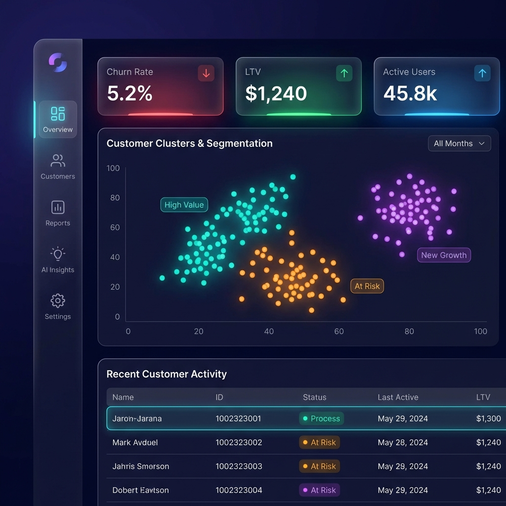

# Customer Segmentation & Churn Prediction


[](https://python.org)
[](https://mysql.com)
[](https://powerbi.microsoft.com)
[](https://scikit-learn.org)

## 📌 Project Overview

This project focuses on analyzing online retail data to segment customers and predict churn. By understanding customer purchasing behavior through **RFM (Recency, Frequency, Monetary)** analysis and **K-Means Clustering**, we identify high-value and at-risk customers. Furthermore, machine learning models (Logistic Regression, Random Forest, XGBoost) are deployed to predict the likelihood of customer churn, enabling proactive retention strategies.

## 🏗️ Architecture

```mermaid
graph LR
    A[Raw Data (CSV/Excel)] --> B(SQL Database);
    B -->|Cleaning & Prep| C{Data Analysis};
    C -->|EDA & Filtering| D[Python Pandas];
    D -->|RFM Calculation| E[K-Means Clustering];
    E -->|Features| F[Churn Prediction Models];
    F -->|Results| G[Power BI Dashboard];
    C -->|Cleaned Data| G;
    
    style A fill:#f9f,stroke:#333,stroke-width:2px
    style B fill:#4479A1,stroke:#333,stroke-width:2px,color:white
    style D fill:#3776AB,stroke:#333,stroke-width:2px,color:white
    style E fill:#F7931E,stroke:#333,stroke-width:2px,color:white
    style G fill:#F2C811,stroke:#333,stroke-width:2px,color:black
```

## 🔍 Key Analysis Steps

### 1. Data Cleaning (SQL & Python)
*   **SQL Queries**: Used for initial data extraction, removing cancelled transactions (`C%`), and filtering invalid records (negative quantity/price).
*   **Python**: Handled missing values, formatted date columns, and derived key metrics like **GMV** (Gross Merchandise Value) and **AOV** (Average Order Value).

### 2. Customer Segmentation (K-Means)
*   **RFM Analysis**: Customers were scored based on:
    *   **Recency**: Days since last purchase.
    *   **Frequency**: Total number of transactions.
    *   **Monetary**: Total revenue generated.
*   **Clustering**: Applied K-Means to group customers into segments (e.g., "Loyalists", "Big Spenders", "At Risk", "Lost").

### 3. Churn Prediction (Machine Learning)
*   **Target Variable**: Defined "Churned" based on a threshold of inactivity (e.g., no purchase in > 90 days).
*   **Models**: Trained and evaluated **Logistic Regression**, **Random Forest**, and **XGBoost**.
*   **Evaluation**: Used Accuracy, Precision, Recall, and ROC-AUC scores to select the best model.

## 📊 Dashboard Visuals

The interactive **Power BI Dashboard** provides a real-time view of customer health and business performance.

### **Sales & Customer Overview**

*Key metrics including Total Sales, Average Purchase Value, and Regional Distribution.*

### **Segmentation & Churn Risk**

*Visualizing customer segments and highlighting those at high risk of churn.*

## 🚀 How to Run

### Prerequisities
*   Python 3.8+
*   MySQL Server
*   Power BI Desktop (for .pbix)

### Steps
1.  **Database Setup**: Run `data/SQL/day2_SQL_Quries.sql` in your SQL client to set up the database and clean the raw data.
2.  **Analysis**: Open `data/notebooks/Combined_Analysis.ipynb` in Jupyter Notebook/Lab to run the full Python analysis pipeline.
3.  **Visualization**: Open `data/powerbi/Day6 & 9_customer segmentation dashboard.pbix` to explore the dashboard.

---
*Created with ❤️ by the Data Science Team*
